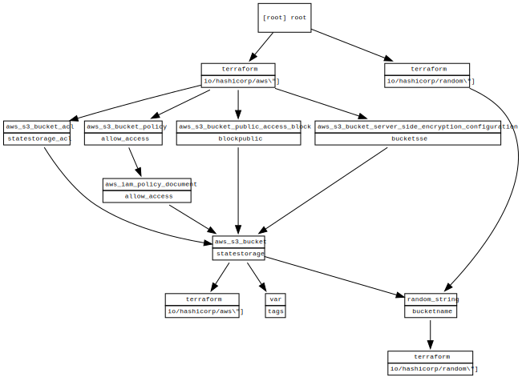

<!-- BEGIN_TF_DOCS -->
# Graphs

A terraform module which deploys S3 and dynamodb which will then be used for terraform remote state
* [Terraform S3 Backend Documentation](https://www.terraform.io/language/settings/backends/s3)
  
## S3
**[README](./modules/s3/README.md)** 

## Dynamodb
**[README](./modules/dynamodb/README.md)** 

## Requirements

| Name | Version |
|------|---------|
|  [aws](#requirement\_aws) | ~> 4.0 |

## Providers

| Name | Version |
|------|---------|
|  [random](#provider\_random) | 3.1.0 |

## Modules

| Name | Source | Version |
|------|--------|---------|
|  [dynamodb](#module\_dynamodb) | ./modules/dynamodb | n/a |
|  [s3](#module\_s3) | ./modules/s3 | n/a |

## Resources

| Name | Type |
|------|------|
| [random_string.bucketname](https://registry.terraform.io/providers/hashicorp/random/latest/docs/resources/string) | resource |

## Inputs

| Name | Description | Type | Default | Required |
|------|-------------|------|---------|:--------:|
|  [tags](#input\_tags) | The tags to set on the resources | <pre>object({     project = string   })</pre> | <pre>{   "project": "remotestage" }</pre> | no |

## Outputs

| Name | Description |
|------|-------------|
|  [bucketname](#output\_bucketname) | the name of the bucket for the state storage |
<!-- END_TF_DOCS -->