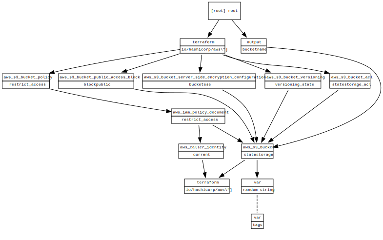
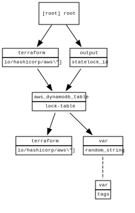

<!-- BEGIN_TF_DOCS -->
# Graphs

A terraform module which deploys S3 and dynamodb which will then be used for terraform remote state
* [Terraform S3 Backend Documentation](https://www.terraform.io/language/settings/backends/s3)
  
## S3
**[README](./modules/s3/README.md)** 

## Dynamodb
**[README](./modules/dynamodb/README.md)** 

## Requirements

| Name | Version |
|------|---------|
|  [aws](#requirement\_aws) | ~> 3.0 |

## Providers

No providers.

## Modules

No modules.

## Resources

No resources.

## Inputs

No inputs.

## Outputs

No outputs.
<!-- END_TF_DOCS -->