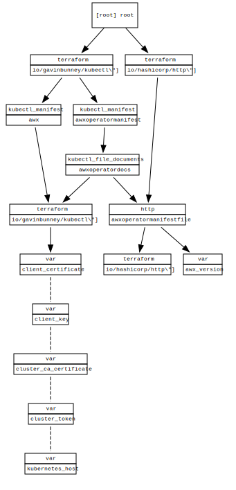

<!-- BEGIN_TF_DOCS -->
# awx on aks deployment

## Requirements

| Name | Version |
|------|---------|
|  [kubectl](#requirement\_kubectl) | >= 1.7.0 |

## Providers

| Name | Version |
|------|---------|
|  [http](#provider\_http) | 2.1.0 |
|  [kubectl](#provider\_kubectl) | 1.13.1 |

## Modules

No modules.

## Resources

| Name | Type |
|------|------|
| [kubectl_manifest.awx](https://registry.terraform.io/providers/gavinbunney/kubectl/latest/docs/resources/manifest) | resource |
| [kubectl_manifest.awxoperatormanifest](https://registry.terraform.io/providers/gavinbunney/kubectl/latest/docs/resources/manifest) | resource |
| [http_http.awxoperatormanifestfile](https://registry.terraform.io/providers/hashicorp/http/latest/docs/data-sources/http) | data source |
| [kubectl_file_documents.awxoperatordocs](https://registry.terraform.io/providers/gavinbunney/kubectl/latest/docs/data-sources/file_documents) | data source |

## Inputs

| Name | Description | Type | Default | Required |
|------|-------------|------|---------|:--------:|
|  [awx\_version](#input\_awx\_version) | the awx version to deploy | `any` | n/a | yes |
|  [client\_certificate](#input\_client\_certificate) | the client certificate to use | `any` | n/a | yes |
|  [client\_key](#input\_client\_key) | the clientkey  to use | `any` | n/a | yes |
|  [cluster\_ca\_certificate](#input\_cluster\_ca\_certificate) | the cluster ca certificate to use | `any` | n/a | yes |
|  [cluster\_token](#input\_cluster\_token) | the token of serviceaccount to use | `any` | n/a | yes |
|  [kubernetes\_host](#input\_kubernetes\_host) | the kubernetes host to use | `any` | n/a | yes |

## Outputs

No outputs.
<!-- END_TF_DOCS -->