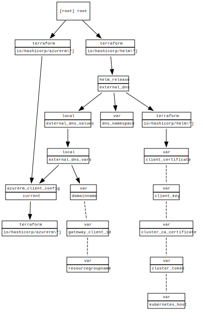

<!-- BEGIN_TF_DOCS -->
# externaldns on aks deployment
Is needed to provision dns entries from ingresses

## Requirements

No requirements.

## Providers

| Name | Version |
|------|---------|
|  [azurerm](#provider\_azurerm) | 2.97.0 |
|  [helm](#provider\_helm) | 2.4.1 |

## Modules

No modules.

## Resources

| Name | Type |
|------|------|
| [helm_release.external_dns](https://registry.terraform.io/providers/hashicorp/helm/latest/docs/resources/release) | resource |
| [azurerm_client_config.current](https://registry.terraform.io/providers/hashicorp/azurerm/latest/docs/data-sources/client_config) | data source |

## Inputs

| Name | Description | Type | Default | Required |
|------|-------------|------|---------|:--------:|
|  [client\_certificate](#input\_client\_certificate) | the client certificate to use | `any` | n/a | yes |
|  [client\_key](#input\_client\_key) | the clientkey  to use | `any` | n/a | yes |
|  [cluster\_ca\_certificate](#input\_cluster\_ca\_certificate) | the cluster ca certificate to use | `any` | n/a | yes |
|  [cluster\_token](#input\_cluster\_token) | the token of serviceaccount to use | `any` | n/a | yes |
|  [dns\_namespace](#input\_dns\_namespace) | the namespace in which to deploy external-dns to | `any` | n/a | yes |
|  [domainname](#input\_domainname) | the domainname to set | `any` | n/a | yes |
|  [kubernetes\_host](#input\_kubernetes\_host) | the kubernetes host to use | `any` | n/a | yes |
|  [resourcegroupname](#input\_resourcegroupname) | the resourcegroupname to set for the resources | `any` | n/a | yes |

## Outputs

No outputs.
<!-- END_TF_DOCS -->