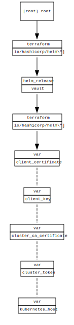

<!-- BEGIN_TF_DOCS -->
# vault on aks deployment

## Requirements

No requirements.

## Providers

| Name | Version |
|------|---------|
|  [helm](#provider\_helm) | 2.4.1 |

## Modules

No modules.

## Resources

| Name | Type |
|------|------|
| [helm_release.vault](https://registry.terraform.io/providers/hashicorp/helm/latest/docs/resources/release) | resource |

## Inputs

| Name | Description | Type | Default | Required |
|------|-------------|------|---------|:--------:|
|  [client\_certificate](#input\_client\_certificate) | the client certificate to use | `any` | n/a | yes |
|  [client\_key](#input\_client\_key) | the clientkey  to use | `any` | n/a | yes |
|  [cluster\_ca\_certificate](#input\_cluster\_ca\_certificate) | the cluster ca certificate to use | `any` | n/a | yes |
|  [cluster\_token](#input\_cluster\_token) | the token of serviceaccount to use | `any` | n/a | yes |
|  [kubernetes\_host](#input\_kubernetes\_host) | the kubernetes host to use | `any` | n/a | yes |
|  [vault\_namespace](#input\_vault\_namespace) | the namespace in which to deploy vault to | `string` | `"vault"` | no |

## Outputs

No outputs.
<!-- END_TF_DOCS -->