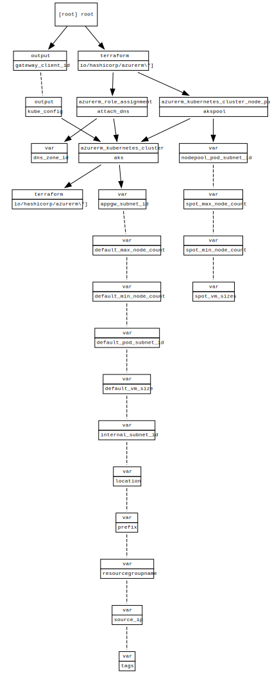

<!-- BEGIN_TF_DOCS -->
# aks deployment

## Requirements

No requirements.

## Providers

| Name | Version |
|------|---------|
|  [azurerm](#provider\_azurerm) | 2.96.0 |

## Modules

No modules.

## Resources

| Name | Type |
|------|------|
| [azurerm_kubernetes_cluster.aks](https://registry.terraform.io/providers/hashicorp/azurerm/latest/docs/resources/kubernetes_cluster) | resource |
| [azurerm_kubernetes_cluster_node_pool.akspool](https://registry.terraform.io/providers/hashicorp/azurerm/latest/docs/resources/kubernetes_cluster_node_pool) | resource |
| [azurerm_role_assignment.attach_dns](https://registry.terraform.io/providers/hashicorp/azurerm/latest/docs/resources/role_assignment) | resource |

## Inputs

| Name | Description | Type | Default | Required |
|------|-------------|------|---------|:--------:|
|  [appgw\_subnet\_id](#input\_appgw\_subnet\_id) | the subnetId in which to deploy the appgateway to | `any` | n/a | yes |
|  [default\_max\_node\_count](#input\_default\_max\_node\_count) | the max nodecount for the default nodepool | `any` | n/a | yes |
|  [default\_min\_node\_count](#input\_default\_min\_node\_count) | the min nodecount for the default nodepool | `any` | n/a | yes |
|  [default\_pod\_subnet\_id](#input\_default\_pod\_subnet\_id) | the subnetId in which to deploy the pods from default pool to | `any` | n/a | yes |
|  [default\_vm\_size](#input\_default\_vm\_size) | the default vm size to use | `any` | n/a | yes |
|  [dns\_zone\_id](#input\_dns\_zone\_id) | the id of the dns zone | `any` | n/a | yes |
|  [internal\_subnet\_id](#input\_internal\_subnet\_id) | the internal subnetId in which to deploy to | `any` | n/a | yes |
|  [location](#input\_location) | location to deploy to | `any` | n/a | yes |
|  [nodepool\_pod\_subnet\_id](#input\_nodepool\_pod\_subnet\_id) | the subnetId in which to deploy the pods from additional pool to | `any` | n/a | yes |
|  [prefix](#input\_prefix) | the project tag to set for the resources | `any` | n/a | yes |
|  [resourcegroupname](#input\_resourcegroupname) | the resourcegroupname to set for the resources | `any` | n/a | yes |
|  [source\_ip](#input\_source\_ip) | Your external IP | `any` | n/a | yes |
|  [spot\_max\_node\_count](#input\_spot\_max\_node\_count) | the max nodecount for the spot nodepool | `any` | n/a | yes |
|  [spot\_min\_node\_count](#input\_spot\_min\_node\_count) | the min nodecount for the spot nodepool | `any` | n/a | yes |
|  [spot\_vm\_sizes](#input\_spot\_vm\_sizes) | the spot vm sizes to use | `any` | n/a | yes |
|  [tags](#input\_tags) | the tag to set for the resources | `string` | `"aks"` | no |

## Outputs

| Name | Description |
|------|-------------|
|  [kube\_config](#output\_kube\_config) | n/a |
<!-- END_TF_DOCS -->