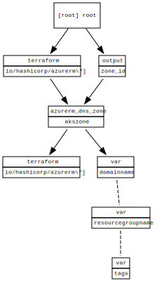

<!-- BEGIN_TF_DOCS -->
# dns deployment

## Requirements

No requirements.

## Providers

| Name | Version |
|------|---------|
|  [azurerm](#provider\_azurerm) | 2.97.0 |

## Modules

No modules.

## Resources

| Name | Type |
|------|------|
| [azurerm_dns_zone.akszone](https://registry.terraform.io/providers/hashicorp/azurerm/latest/docs/resources/dns_zone) | resource |

## Inputs

| Name | Description | Type | Default | Required |
|------|-------------|------|---------|:--------:|
|  [domainname](#input\_domainname) | the domainname to set | `any` | n/a | yes |
|  [resourcegroupname](#input\_resourcegroupname) | the resourcegroupname to set for the resources | `any` | n/a | yes |
|  [tags](#input\_tags) | the tag to set for the resources | `string` | `"aks"` | no |

## Outputs

| Name | Description |
|------|-------------|
|  [zone\_id](#output\_zone\_id) | n/a |
<!-- END_TF_DOCS -->