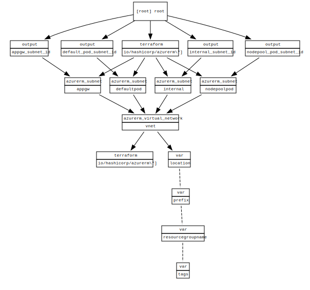

<!-- BEGIN_TF_DOCS -->
# vnet deployment

## Requirements

No requirements.

## Providers

| Name | Version |
|------|---------|
|  [azurerm](#provider\_azurerm) | 2.96.0 |

## Modules

No modules.

## Resources

| Name | Type |
|------|------|
| [azurerm_route_table.podroutetable](https://registry.terraform.io/providers/hashicorp/azurerm/latest/docs/resources/route_table) | resource |
| [azurerm_subnet.appgw](https://registry.terraform.io/providers/hashicorp/azurerm/latest/docs/resources/subnet) | resource |
| [azurerm_subnet.internal](https://registry.terraform.io/providers/hashicorp/azurerm/latest/docs/resources/subnet) | resource |
| [azurerm_subnet_route_table_association.podappgwrouteassoc](https://registry.terraform.io/providers/hashicorp/azurerm/latest/docs/resources/subnet_route_table_association) | resource |
| [azurerm_subnet_route_table_association.podnoderouteassoc](https://registry.terraform.io/providers/hashicorp/azurerm/latest/docs/resources/subnet_route_table_association) | resource |
| [azurerm_virtual_network.vnet](https://registry.terraform.io/providers/hashicorp/azurerm/latest/docs/resources/virtual_network) | resource |

## Inputs

| Name | Description | Type | Default | Required |
|------|-------------|------|---------|:--------:|
|  [location](#input\_location) | location to deploy to | `any` | n/a | yes |
|  [prefix](#input\_prefix) | the project tag to set for the resources | `any` | n/a | yes |
|  [resourcegroupname](#input\_resourcegroupname) | the resourcegroupname to set for the resources | `any` | n/a | yes |
|  [tags](#input\_tags) | the tag to set for the resources | `string` | `"aks"` | no |

## Outputs

| Name | Description |
|------|-------------|
|  [appgw\_subnet\_id](#output\_appgw\_subnet\_id) | n/a |
|  [internal\_subnet\_id](#output\_internal\_subnet\_id) | n/a |
<!-- END_TF_DOCS -->