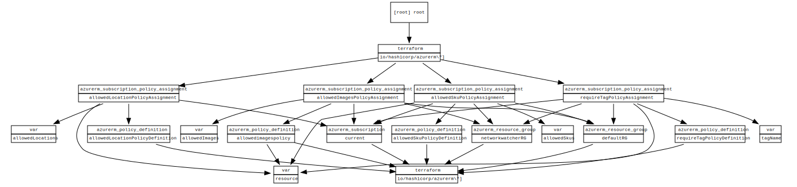

# azure-policy

A repo to store policies for azure in terraform (allowedLocation and require tag)

<!-- BEGIN_TF_DOCS -->
## Requirements

| Name | Version |
|------|---------|
|  [azurerm](#requirement\_azurerm) | =2.46.0 |

## Providers

| Name | Version |
|------|---------|
|  [azurerm](#provider\_azurerm) | 2.46.0 |

## Modules

No modules.

## Resources

| Name | Type |
|------|------|
| [azurerm_policy_assignment.allowedImagesPolicyAssignment](https://registry.terraform.io/providers/hashicorp/azurerm/2.46.0/docs/resources/policy_assignment) | resource |
| [azurerm_policy_assignment.allowedLocationPolicyAssignment](https://registry.terraform.io/providers/hashicorp/azurerm/2.46.0/docs/resources/policy_assignment) | resource |
| [azurerm_policy_assignment.allowedSkuPolicyAssignment](https://registry.terraform.io/providers/hashicorp/azurerm/2.46.0/docs/resources/policy_assignment) | resource |
| [azurerm_policy_assignment.requireTagPolicyAssignment](https://registry.terraform.io/providers/hashicorp/azurerm/2.46.0/docs/resources/policy_assignment) | resource |
| [azurerm_policy_definition.allowedimagespolicy](https://registry.terraform.io/providers/hashicorp/azurerm/2.46.0/docs/resources/policy_definition) | resource |

## Inputs

| Name | Description | Type | Default | Required |
|------|-------------|------|---------|:--------:|
|  [allowedImages](#input\_allowedImages) | Map of images names for configuration. | <pre>list(object({     publisher = string     offer     = string     sku       = string     version   = string   }))</pre> | n/a | yes |
|  [allowedLocationSubPolicyId](#input\_allowedLocationSubPolicyId) | The PolicyId for the default allowedLocation Definition | `string` | `"PolId"` | no |
|  [allowedLocations](#input\_allowedLocations) | The allowed Locations | `list(string)` | <pre>[   "Germany West Central",   "West Europe" ]</pre> | no |
|  [allowedSkuPolicyId](#input\_allowedSkuPolicyId) | The PolicyId for the default allowedSku Definition | `string` | `"PolId"` | no |
|  [allowedSkus](#input\_allowedSkus) | The allowed skus | `list(string)` | n/a | yes |
|  [networkwatcher\_rg\_Id](#input\_networkwatcher\_rg\_Id) | The ResourceGroupId for the networkwatcher resourcegroup | `string` | `"rg"` | no |
|  [resource](#input\_resource) | n/a | `map` | <pre>{   "location": "Germany West Central",   "prefix": "tf-managed-policy",   "project": "az-900-prep" }</pre> | no |
|  [subscriptionId](#input\_subscriptionId) | The subscriptionId | `string` | `"SubId"` | no |
|  [tagName](#input\_tagName) | the tagName to require on all resources | `string` | `"project"` | no |
|  [tagPolicyId](#input\_tagPolicyId) | The PolicyDefinition Id for the default require tag Policy | `string` | `"PolId"` | no |

## Outputs

No outputs.
<!-- END_TF_DOCS -->