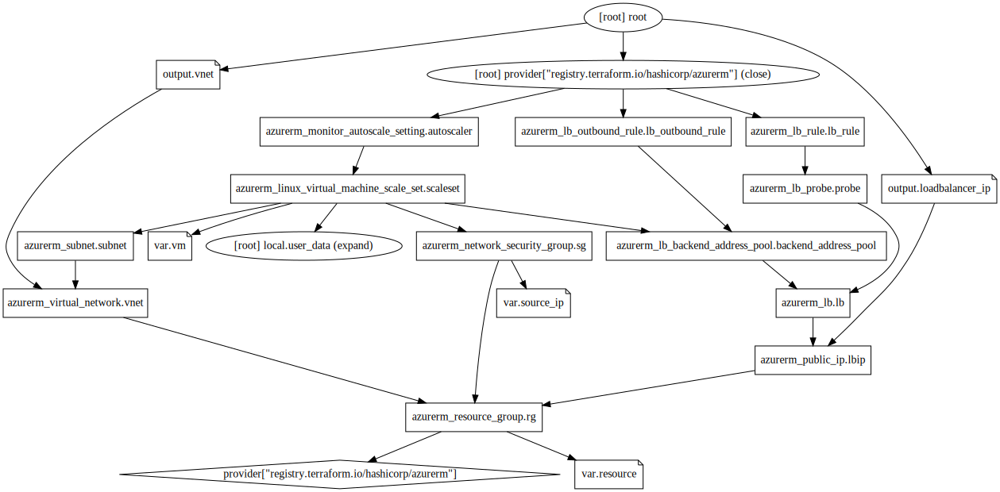

# azure-policy

A module to deploy azure linux vm on a webserver with autoscaling and loadbalancing

<!-- BEGIN_TF_DOCS -->
## Requirements

| Name | Version |
|------|---------|
|  [azurerm](#requirement\_azurerm) | >=2.94.0 |

## Providers

| Name | Version |
|------|---------|
|  [azurerm](#provider\_azurerm) | 2.94.0 |

## Modules

| Name | Source | Version |
|------|--------|---------|
|  [appgateway](#module\_appgateway) | ./modules/appgateway | n/a |
|  [monitoring](#module\_monitoring) | ./modules/monitoring | n/a |
|  [scaleset](#module\_scaleset) | ./modules/scaleset | n/a |
|  [vnet](#module\_vnet) | ./modules/vnet | n/a |

## Resources

| Name | Type |
|------|------|
| [azurerm_resource_group.rg](https://registry.terraform.io/providers/hashicorp/azurerm/latest/docs/resources/resource_group) | resource |

## Inputs

| Name | Description | Type | Default | Required |
|------|-------------|------|---------|:--------:|
|  [resource](#input\_resource) | n/a | `map` | <pre>{   "location": "Germany West Central",   "prefix": "webserver",   "project": "scaled-webserver" }</pre> | no |
|  [source\_ip](#input\_source\_ip) | Your source ip | `string` | `"1.1.1.1"` | no |
|  [vm](#input\_vm) | n/a | `map` | <pre>{   "admin_username": "azureuser",   "size": "Standard_F1s" }</pre> | no |

## Outputs

| Name | Description |
|------|-------------|
|  [gateway\_ip](#output\_gateway\_ip) | n/a |
|  [vnet\_name](#output\_vnet\_name) | n/a |
|  [vnet\_resourcegroup](#output\_vnet\_resourcegroup) | n/a |
<!-- END_TF_DOCS -->