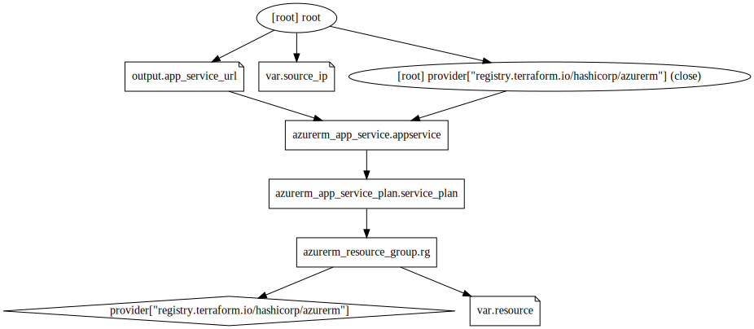

<!-- BEGIN_TF_DOCS -->
## Requirements

| Name | Version |
|------|---------|
|  [azurerm](#requirement\_azurerm) | =2.46.0 |

## Providers

| Name | Version |
|------|---------|
|  [azurerm](#provider\_azurerm) | 2.46.0 |

## Modules

No modules.

## Resources

| Name | Type |
|------|------|
| [azurerm_app_service.appservice](https://registry.terraform.io/providers/hashicorp/azurerm/2.46.0/docs/resources/app_service) | resource |
| [azurerm_app_service_plan.service_plan](https://registry.terraform.io/providers/hashicorp/azurerm/2.46.0/docs/resources/app_service_plan) | resource |
| [azurerm_resource_group.rg](https://registry.terraform.io/providers/hashicorp/azurerm/2.46.0/docs/resources/resource_group) | resource |

## Inputs

| Name | Description | Type | Default | Required |
|------|-------------|------|---------|:--------:|
|  [resource](#input\_resource) | n/a | `map` | <pre>{   "location": "Germany West Central",   "prefix": "az-900-02-tf",   "project": "az-900-prep" }</pre> | no |
|  [source\_ip](#input\_source\_ip) | Your source ip | `string` | `"1.1.1.1"` | no |

## Outputs

| Name | Description |
|------|-------------|
|  [app\_service\_url](#output\_app\_service\_url) | The URL on which to access the appservice. |
<!-- END_TF_DOCS -->