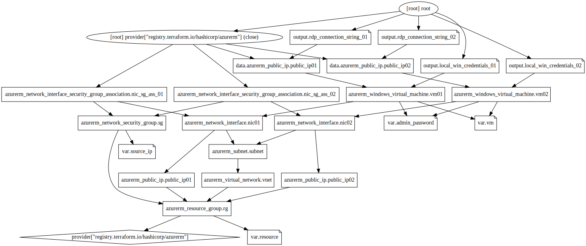

<!-- BEGIN_TF_DOCS -->
## Requirements

| Name | Version |
|------|---------|
|  [azurerm](#requirement\_azurerm) | =2.46.0 |

## Providers

| Name | Version |
|------|---------|
|  [azurerm](#provider\_azurerm) | 2.46.0 |

## Modules

No modules.

## Resources

| Name | Type |
|------|------|
| [azurerm_network_interface.nic01](https://registry.terraform.io/providers/hashicorp/azurerm/2.46.0/docs/resources/network_interface) | resource |
| [azurerm_network_interface.nic02](https://registry.terraform.io/providers/hashicorp/azurerm/2.46.0/docs/resources/network_interface) | resource |
| [azurerm_network_interface_security_group_association.nic_sg_ass_01](https://registry.terraform.io/providers/hashicorp/azurerm/2.46.0/docs/resources/network_interface_security_group_association) | resource |
| [azurerm_network_interface_security_group_association.nic_sg_ass_02](https://registry.terraform.io/providers/hashicorp/azurerm/2.46.0/docs/resources/network_interface_security_group_association) | resource |
| [azurerm_network_security_group.sg](https://registry.terraform.io/providers/hashicorp/azurerm/2.46.0/docs/resources/network_security_group) | resource |
| [azurerm_public_ip.public_ip01](https://registry.terraform.io/providers/hashicorp/azurerm/2.46.0/docs/resources/public_ip) | resource |
| [azurerm_public_ip.public_ip02](https://registry.terraform.io/providers/hashicorp/azurerm/2.46.0/docs/resources/public_ip) | resource |
| [azurerm_resource_group.rg](https://registry.terraform.io/providers/hashicorp/azurerm/2.46.0/docs/resources/resource_group) | resource |
| [azurerm_subnet.subnet](https://registry.terraform.io/providers/hashicorp/azurerm/2.46.0/docs/resources/subnet) | resource |
| [azurerm_virtual_network.vnet](https://registry.terraform.io/providers/hashicorp/azurerm/2.46.0/docs/resources/virtual_network) | resource |
| [azurerm_windows_virtual_machine.vm01](https://registry.terraform.io/providers/hashicorp/azurerm/2.46.0/docs/resources/windows_virtual_machine) | resource |
| [azurerm_windows_virtual_machine.vm02](https://registry.terraform.io/providers/hashicorp/azurerm/2.46.0/docs/resources/windows_virtual_machine) | resource |
| [azurerm_public_ip.public_ip01](https://registry.terraform.io/providers/hashicorp/azurerm/2.46.0/docs/data-sources/public_ip) | data source |
| [azurerm_public_ip.public_ip02](https://registry.terraform.io/providers/hashicorp/azurerm/2.46.0/docs/data-sources/public_ip) | data source |

## Inputs

| Name | Description | Type | Default | Required |
|------|-------------|------|---------|:--------:|
|  [admin\_password](#input\_admin\_password) | The vm password | `string` | `"aws"` | no |
|  [resource](#input\_resource) | n/a | `map` | <pre>{   "location": "Germany West Central",   "prefix": "az-900-04-tf",   "project": "az-900-prep" }</pre> | no |
|  [source\_ip](#input\_source\_ip) | Your source ip | `string` | `"1.1.1.1"` | no |
|  [vm](#input\_vm) | n/a | `map` | <pre>{   "admin_username": "azureuser",   "size": "Standard_B2s" }</pre> | no |

## Outputs

| Name | Description |
|------|-------------|
|  [local\_win\_credentials\_01](#output\_local\_win\_credentials\_01) | the credentials for the frist vm |
|  [local\_win\_credentials\_02](#output\_local\_win\_credentials\_02) | the credentials for the second vm |
|  [rdp\_connection\_string\_01](#output\_rdp\_connection\_string\_01) | The command for mstsc to the first vm |
|  [rdp\_connection\_string\_02](#output\_rdp\_connection\_string\_02) | The command for mstsc to the second vm |
<!-- END_TF_DOCS -->