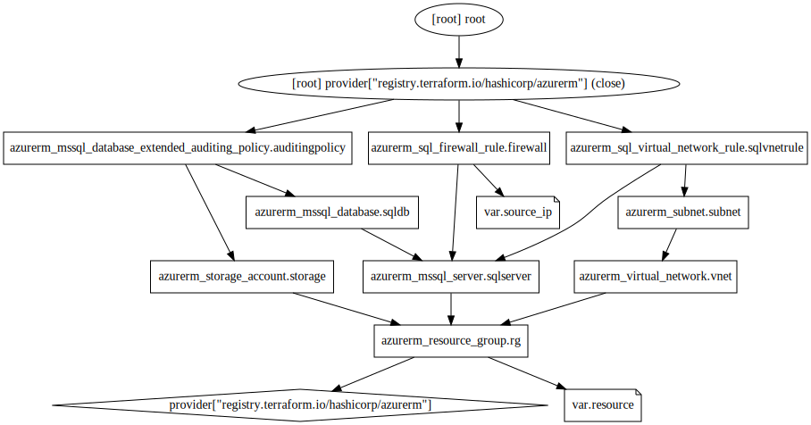

<!-- BEGIN_TF_DOCS -->
## Requirements

| Name | Version |
|------|---------|
|  [azurerm](#requirement\_azurerm) | =2.46.0 |

## Providers

| Name | Version |
|------|---------|
|  [azurerm](#provider\_azurerm) | 2.46.0 |

## Modules

No modules.

## Resources

| Name | Type |
|------|------|
| [azurerm_mssql_database.sqldb](https://registry.terraform.io/providers/hashicorp/azurerm/2.46.0/docs/resources/mssql_database) | resource |
| [azurerm_mssql_database_extended_auditing_policy.auditingpolicy](https://registry.terraform.io/providers/hashicorp/azurerm/2.46.0/docs/resources/mssql_database_extended_auditing_policy) | resource |
| [azurerm_mssql_server.sqlserver](https://registry.terraform.io/providers/hashicorp/azurerm/2.46.0/docs/resources/mssql_server) | resource |
| [azurerm_resource_group.rg](https://registry.terraform.io/providers/hashicorp/azurerm/2.46.0/docs/resources/resource_group) | resource |
| [azurerm_sql_firewall_rule.firewall](https://registry.terraform.io/providers/hashicorp/azurerm/2.46.0/docs/resources/sql_firewall_rule) | resource |
| [azurerm_sql_virtual_network_rule.sqlvnetrule](https://registry.terraform.io/providers/hashicorp/azurerm/2.46.0/docs/resources/sql_virtual_network_rule) | resource |
| [azurerm_storage_account.storage](https://registry.terraform.io/providers/hashicorp/azurerm/2.46.0/docs/resources/storage_account) | resource |
| [azurerm_subnet.subnet](https://registry.terraform.io/providers/hashicorp/azurerm/2.46.0/docs/resources/subnet) | resource |
| [azurerm_virtual_network.vnet](https://registry.terraform.io/providers/hashicorp/azurerm/2.46.0/docs/resources/virtual_network) | resource |

## Inputs

| Name | Description | Type | Default | Required |
|------|-------------|------|---------|:--------:|
|  [resource](#input\_resource) | n/a | `map` | <pre>{   "location": "Germany West Central",   "prefix": "az-900-05-tf",   "project": "az-900-prep" }</pre> | no |
|  [source\_ip](#input\_source\_ip) | Your source ip | `string` | `"1.1.1.1"` | no |

## Outputs

No outputs.
<!-- END_TF_DOCS -->