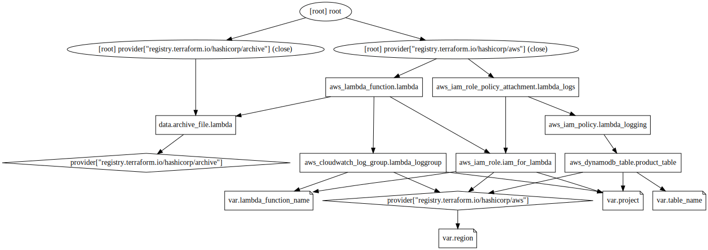

<!-- BEGIN_TF_DOCS -->
## Requirements

| Name | Version |
|------|---------|
|  [aws](#requirement\_aws) | ~> 3.0 |

## Providers

| Name | Version |
|------|---------|
|  [archive](#provider\_archive) | 2.2.0 |
|  [aws](#provider\_aws) | 3.73.0 |

## Modules

No modules.

## Resources

| Name | Type |
|------|------|
| [aws_cloudwatch_log_group.lambda_loggroup](https://registry.terraform.io/providers/hashicorp/aws/latest/docs/resources/cloudwatch_log_group) | resource |
| [aws_dynamodb_table.product_table](https://registry.terraform.io/providers/hashicorp/aws/latest/docs/resources/dynamodb_table) | resource |
| [aws_iam_policy.lambda_logging](https://registry.terraform.io/providers/hashicorp/aws/latest/docs/resources/iam_policy) | resource |
| [aws_iam_role.iam_for_lambda](https://registry.terraform.io/providers/hashicorp/aws/latest/docs/resources/iam_role) | resource |
| [aws_iam_role_policy_attachment.lambda_logs](https://registry.terraform.io/providers/hashicorp/aws/latest/docs/resources/iam_role_policy_attachment) | resource |
| [aws_lambda_function.lambda](https://registry.terraform.io/providers/hashicorp/aws/latest/docs/resources/lambda_function) | resource |
| [archive_file.lambda](https://registry.terraform.io/providers/hashicorp/archive/latest/docs/data-sources/file) | data source |

## Inputs

| Name | Description | Type | Default | Required |
|------|-------------|------|---------|:--------:|
|  [lambda\_function\_name](#input\_lambda\_function\_name) | n/a | `string` | `"apilambda"` | no |
|  [project](#input\_project) | n/a | `string` | `"simpleapigateway"` | no |
|  [region](#input\_region) | n/a | `string` | `"eu-central-1"` | no |
|  [table\_name](#input\_table\_name) | n/a | `string` | `"producttable"` | no |

## Outputs

No outputs.
<!-- END_TF_DOCS -->